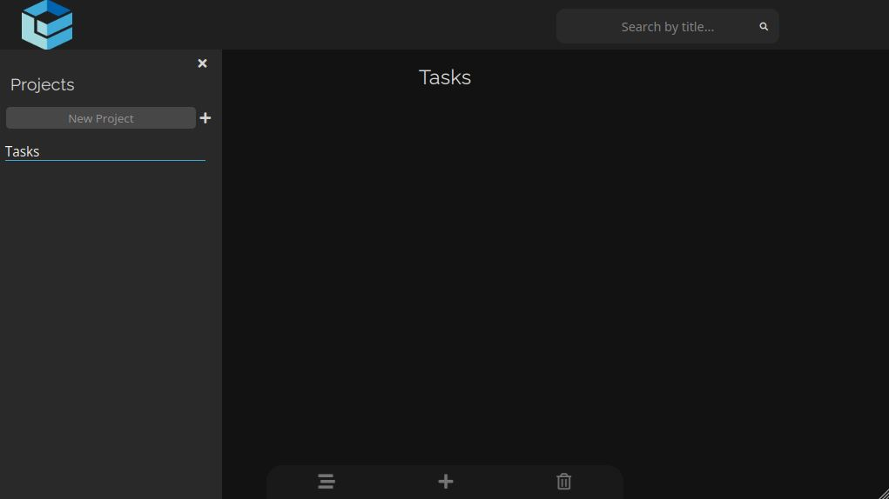

# Task-Tracker



My third iteration of the classic, to-do list. It was built as part of The Odin Project's curriculum, with a mobile-first approach and was bundled together through Webpack.

## Installation

After cloning, it would be essential to _install_ the dependencies:

```bash
npm install
```

Creating the _dist_ directory would require building:

```bash
npm run build
```

`watch` has also been configured and you can run it as:

```bash
npm run watch
```

## Features

- Supports multiple tasks & projects.
- Sports a functional bar, which allows searching all projects for the specific task title.

## Tech

- JavaScript
- Webpack
- NPM
- FontAwesome Free
- SCSS
- HTML

For a detailed overview of the dev dependencies, please check `package.json`.

## Contributions

Contributions are certainly welcome. Please feel free to open an issue/PR if there is something you would like to be changed.

## Acknowledgements

A massive thank you to The Odin Project & freeCodeCamp community, as their guidance and learning process have been invaluable.

## Live Version

<https://developedbygeo.github.io/Task-Tracker>

## License

[MIT](./LICENSE.md)
